# Final Project by Zeliang Yin
## Database Setup
### MySQL
#### Create Schema
```sql
drop schema if exists eshop;
create schema eshop;
```
#### Create & Grant Privileges
```sql
CREATE USER 'admin'@'%' IDENTIFIED BY 'admin';
GRANT ALL PRIVILEGES ON eshop.* TO 'admin'@'%';
FLUSH PRIVILEGES;
```
### MongoDB
1. Install MongoDB
2. Add a new connection to `mongodb://localhost:27017`
### Cassandra
Cassandra is setup by Docker. You just need to start the service and create keyspace.
#### Start Service
Open docker and start `eshop-cassandra` service in `/docker-compose.yml`.
#### Create Keyspace
1. Access cassandra (cmd)
    ```
    docker exec -it eshop-cassandra cqlsh
    ```
2. Create keyspace
    ```
    CREATE KEYSPACE eshop WITH replication = {'class': 'SimpleStrategy', 'replication_factor': 1};
    ```
3. If you want to lookup the data
    ```
    SELECT * FROM orders;
    ```
## Docker Setup
Install and open Docker Desktop
## Project Start
1. Run services in `/docker-compose.yml`
2. Run `Auth` service
3. Run `Account` service
4. Run `Item` service
5. Run `Order` service
## API
#### Account
##### Auth
1. Login: `POST` `http://localhost:8080/api/v1/auth/login`
2. Signup: `POST` `http://localhost:8080/api/v1/auth/signup`
##### User
1. Create user:  `POST` `http://localhost:8080/api/v1/users`
2. Get user by email: `GET` `http://localhost:8080/api/v1/users/{email}`
3. Update user by email: `PUT` `http://localhost:8080/api/v1/users/{email}`
4. Delete user by email: `DELETE` `http://localhost:8080/api/v1/users/{email}`
##### Item
1. Create item:  `POST` `http://localhost:8080/api/v1/items`
2. Get item by name: `GET` `http://localhost:8080/api/v1/items?name={name}`
3. Get item by id: `GET` `http://localhost:8080/api/v1/items/{id}`
4. Update item by id: `PUT` `http://localhost:8080/api/v1/items/{id}`
5. Delete item by id: `DELETE` `http://localhost:8080/api/v1/items/{id}`
##### Order
1. Create order:  `POST` `http://localhost:8080/api/v1/orders`
2. Get all orders: `GET` `http://localhost:8080/api/v1/orders`
3. Get order by id: `GET` `http://localhost:8080/api/v1/orders/{id}`
4. Update order by id: `PUT` `http://localhost:8080/api/v1/orders/{id}`
5. Delete order by id: `DELETE` `http://localhost:8080/api/v1/orders/{id}`
## Project Details
### API Gateway
#### Main Functions
-  Authentication
#### Server Port
**8080 (All other servises can be accessed through 8080 with JWT token)**
#### Structure

#### Authentication
Implements `WebFilter` to filter the requests with valid JWT token, but the auth API is open for all requests.
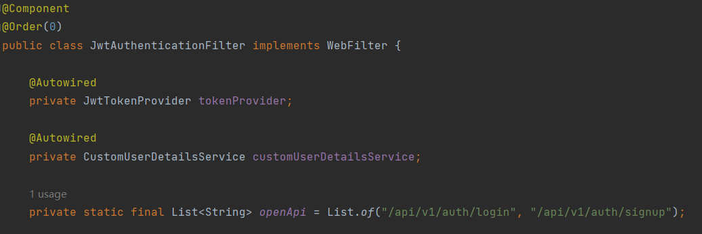
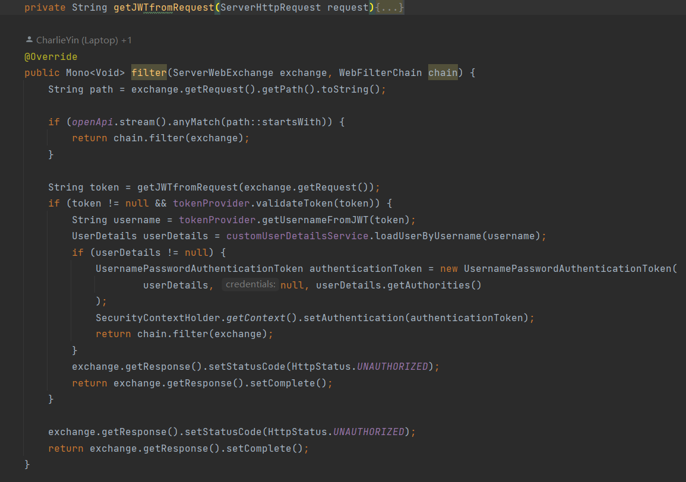
The requests without valid JWT token will receive `401 Unauthorized` code.
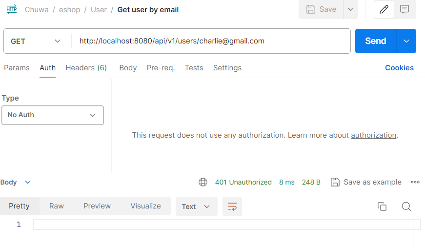
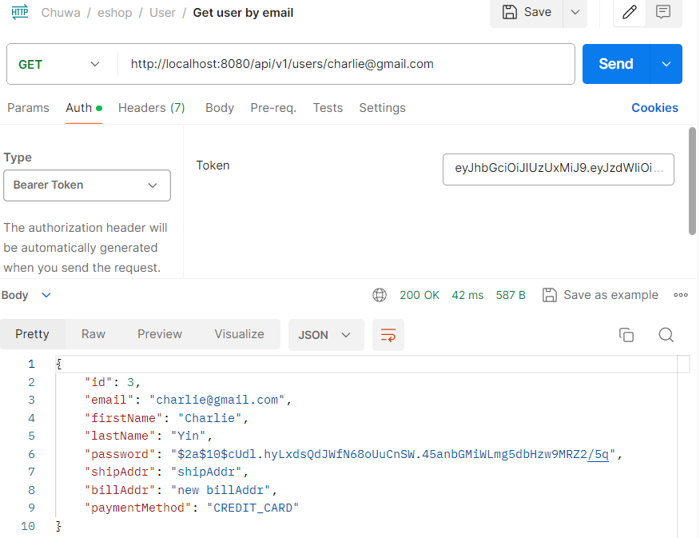
#### Router
Use RouteLocator to route request to all services.
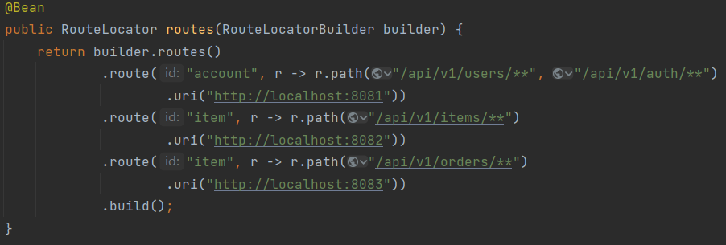
### Account Service
#### Main Functions
1. Authorization (login/signup) and generate JWT
2. User CRUD
#### Server Port
8081
#### Structure


#### Authorization
When auth APIs are called, generate JWT token and send it to frontend. `AuthenticationManager` needs `UserDetailsService` to run when generating authentication.
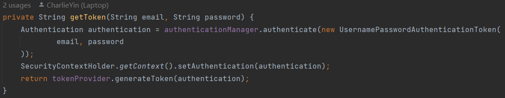
### Item Service
#### Main Functions
1. Item CRUD
2. Access Kafka:
    - To verify whether the item count is enough as consumer
    - To finish the orders' creation if the count is enough as provider
#### Server Port
8082
#### Structure
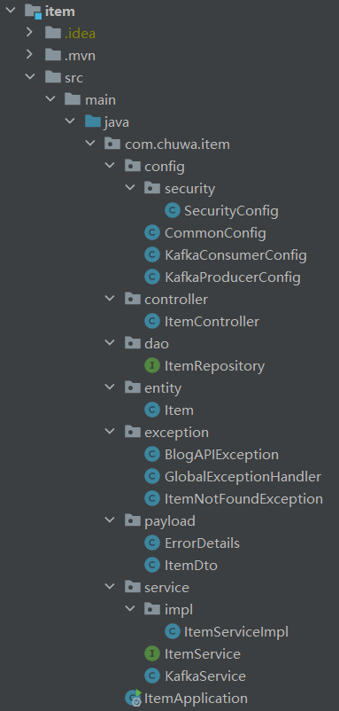
#### Kafka provider/consumer
`item-group` receives the message from topic `item-count`.
- If the count is enough, provide the count message to topic `order-create` to create the order.
- If the count is not enough, provide the count message to topic `order-create` to make the order invalid.

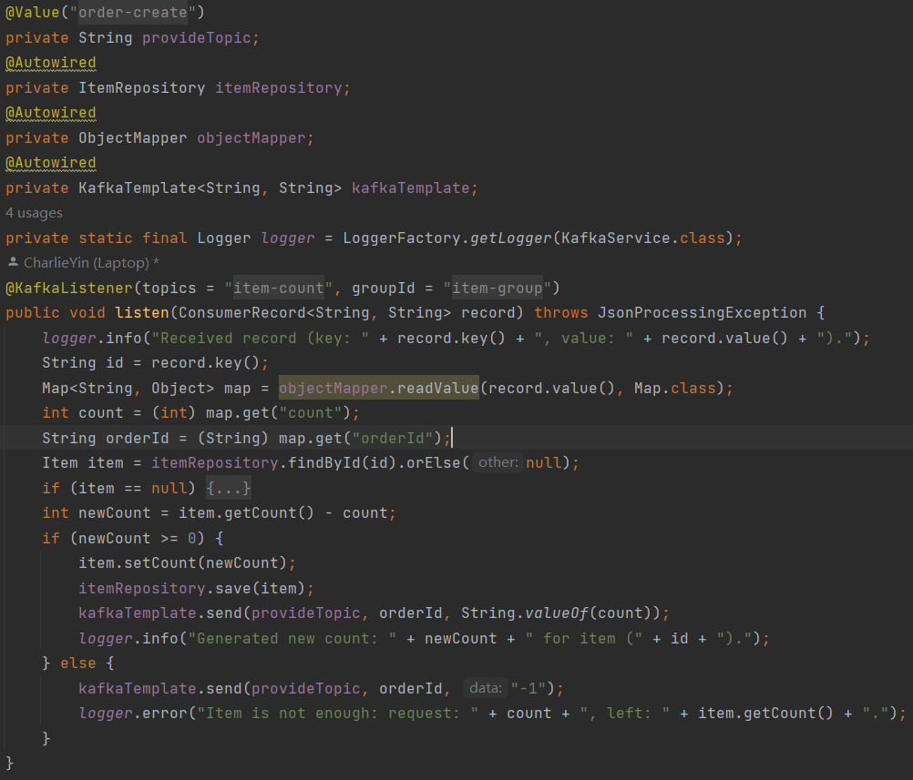
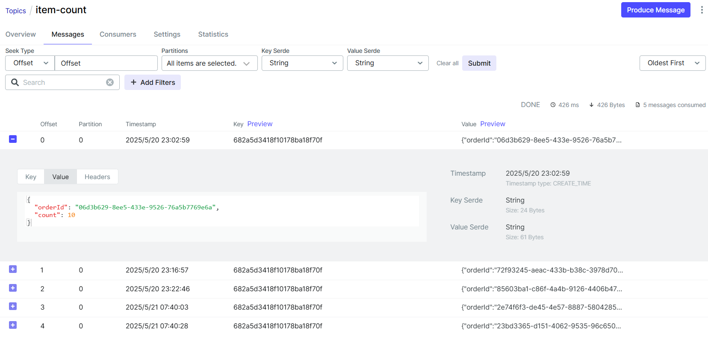
### Order Service
#### Main Functions
1. Order CRUD
2. Access Kafka:
    - To finish the orders' creation after count verification as consumer
    - To request whether the count is enough as provider
#### Server Port
8083
#### Structure
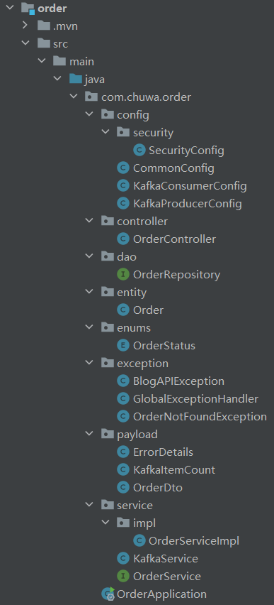
#### Kafka provider/consumer
When creating order, make the order status `TRY_TO_ORDER`. Then send message to Kafka to verity if the item count is enough or not.
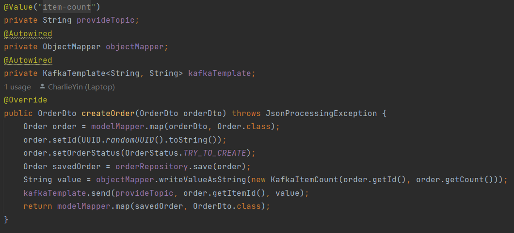
`order-group` receives the message from topic `order-create`.
- If the count is enough, make the order status `CREATE`.
- If the count is not enough, make the order status `INVALID`.

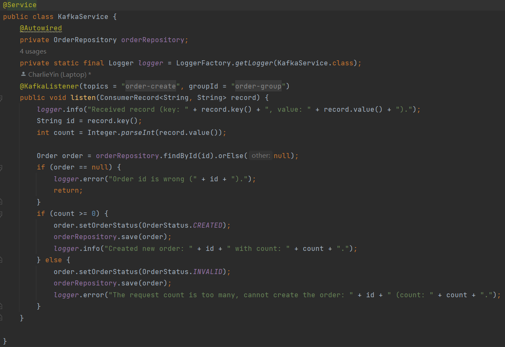
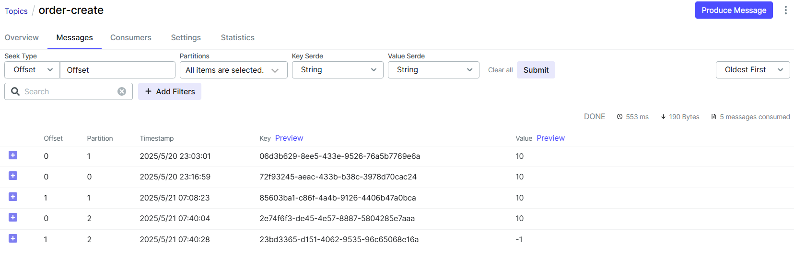