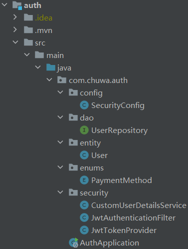
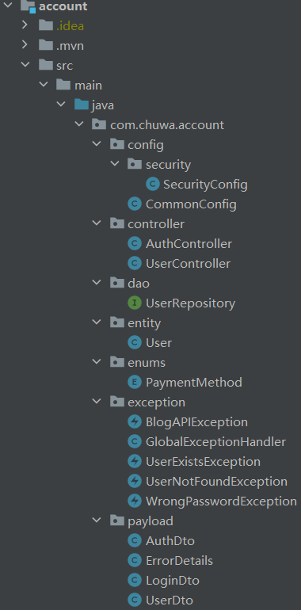
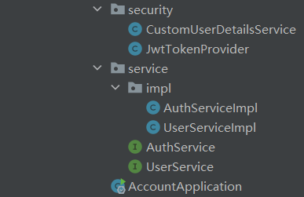

# Final Project by Zeliang Yin
## Database Setup
### MySQL
#### Create Schema
```sql
drop schema if exists eshop;
create schema eshop;
```
#### Create & Grant Privileges
```sql
CREATE USER 'admin'@'%' IDENTIFIED BY 'admin';
GRANT ALL PRIVILEGES ON eshop.* TO 'admin'@'%';
FLUSH PRIVILEGES;
```
### MongoDB
1. Install MongoDB
2. Add a new connection to `mongodb://localhost:27017`
### Cassandra
Cassandra is setup by Docker. You just need to start the service and create keyspace.
#### Start Service
Open docker and start `eshop-cassandra` service in `/docker-compose.yml`.
#### Create Keyspace
1. Access cassandra (cmd)
    ```
    docker exec -it eshop-cassandra cqlsh
    ```
2. Create keyspace
    ```
    CREATE KEYSPACE eshop WITH replication = {'class': 'SimpleStrategy', 'replication_factor': 1};
    ```
3. If you want to lookup the data
    ```
    SELECT * FROM orders;
    ```
## Docker Setup
Install and open Docker Desktop
## Project Details
### API Gateway
#### Main Functions
-  Authentication
#### Structure

### Account Service
#### Main Functions
1. Authorization (login/signup) and generate JWT
2. User CRUD
#### Structure


### Item Service
#### Main Functions
1. Item CRUD
2. Access Kafka:
    - To verify whether the item count is enough as consumer
    - To finish the orders' creation if the count is enough as provider
#### Structure


### Order Service
#### Main Functions
1. Order CRUD
2. Access Kafka:
    - To finish the orders' creation after count verification as consumer
    - To request whether the count is enough as provider
#### Structure

